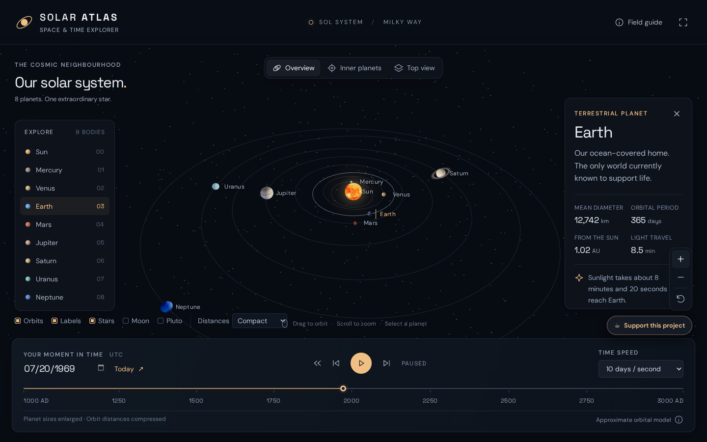

# Solar Atlas

Explore the solar system in 3D, from **10,000 BCE to 10,000 CE**. Follow the eight planets, optionally show Earth's Moon and Pluto, and explore the solar system on desktop or mobile.

[**Open Solar Atlas**](https://dcr6174.github.io/solar-atlas/) · [Support the project](https://buymeacoffee.com/dcr6174)

## Screenshots and recording

Desktop capture from the responsive interactive WebGL2 app:



[Watch the short screen recording](media/demo.webm) · [Promotional social preview artwork](social-preview.jpg)

## Explore

- Drag, swipe, or use **W A S D** to rotate the camera; scroll or pinch to zoom. Click a body or choose it from the list.
- Follow planets up close and switch between overview, inner planets, and top views. Earth's close-up and region selectors have been removed.
- The desktop and mobile layouts adapt automatically to screen size. On mobile, the planet selector scrolls horizontally and details open as a compact panel.
- Scrub calendar time from 10,000 BCE through 10,000 CE. Type a date such as `0044-03-15 BCE` or `10000-12-31 CE`. The slider moves in one-day steps and stays aligned with the date field. Play or reverse at adjustable speeds.
- Copy the browser URL to share the selected body and date, for example [`#date=1969-07-20-CE&body=earth`](https://dcr6174.github.io/solar-atlas/#date=1969-07-20-CE&body=earth).
- Toggle the Moon, Pluto, orbital paths, labels, and stars. Choose compact or proportional orbital distance.
- Install the progressive web app from a supported browser; once the app has loaded online, its core interface and planet textures can open offline.
- Tap the small coffee icon in the corner to open a closable support card linking to [Buy Me a Coffee](https://buymeacoffee.com/dcr6174).

## Run locally

Requires Node.js 18 or newer. No install, build step, account, or API key is needed.

```bash
git clone https://github.com/dcr6174/solar-atlas.git
cd solar-atlas
npm start
```

Open **http://localhost:8080** in a WebGL2 capable browser. Use a local server: opening `index.html` through `file://` prevents JavaScript modules and offline features from working correctly.

The [GitHub Pages site](https://dcr6174.github.io/solar-atlas/) publishes from `main` at the repository root. `.nojekyll` and relative asset paths support project Pages hosting.

## Controls

| Action | Control |
| --- | --- |
| Orbit camera | Drag or swipe; **W A S D** when a text control is not focused |
| Zoom | Mouse wheel, pinch, or + / − buttons |
| Pan | Right-drag or two fingers |
| Select a body | Click its sphere or name |
| Follow a planet or the Sun | Explore up close or double-click its sphere |
| Return from a close-up | Back to solar system |
| Play / pause | Space when a text control is not focused |
| Step time | Left / right arrow keys: one day |
| Reset camera | R |
| Leave close-up | Escape |

## Common problems

- **The 3D view could not start:** Enable hardware acceleration and WebGL2, update the browser, then reload. Some remote browsers cannot create a WebGL context.
- **Planets fail to load:** Check your connection on the first visit, reload, or clear site data if a previous offline cache is stuck.
- **An old version appears:** Hard refresh the page, or clear the site's stored data. Versioned CSS/JS and the service worker normally update on a return visit.
- **The page does not work from a local file:** Use `npm start` and open `http://localhost:8080`.
- **Orbit positions look unusual on historical dates:** Positions are approximate; see the scientific scope below.

## Validation

```bash
npm test
npm run check
```

Tests cover the eight planets' orbital bounds across the JPL fitted 3000 BCE–3000 CE interval, BCE/CE and leap-year validation, 10,000 BCE–10,000 CE slider boundaries, and an Earth J2000 sanity check. Browser visual behavior requires a WebGL2 browser and is separate from these checks.

## Scientific scope

The eight planet positions use [NASA JPL's long-range approximate Keplerian elements](https://ssd.jpl.nasa.gov/planets/approx_pos.html), including Jupiter–Neptune corrections. **Those elements are fitted for 3000 BCE–3000 CE only.** Before 3000 BCE and after 3000 CE, orbital positions are illustrative extrapolations. Earth uses the Earth–Moon barycenter. The Moon's position around Earth and Pluto's orbit are **illustrative**, outside this eight-planet JPL model. Their size and spacing are enlarged so they remain visible.

This educational visualization is not a precision ephemeris or eclipse predictor. Dates use the proleptic Gregorian calendar and UTC as an approximation for ephemeris time. Compact mode compresses distances; rotations, orientations, surface maps, and ancient appearances are illustrative. The present-day Earth texture is reused for historical dates.

## Files and credits

- `index.html`, `style.css`, `app.js`, `orbits.js`, `timeline.js`: app and orbital model.
- `manifest.webmanifest`, `sw.js`: installation and offline cache.
- `assets/`: compressed WebP planet textures, ring texture, bundled Three.js and OrbitControls.
- `tools/serve.mjs`, `tests/orbits.test.mjs`: local server and orbital checks.
- `THIRD_PARTY_NOTICES.md`: texture and dependency attribution.

Code is available under the [MIT License](LICENSE). Three.js r170 and OrbitControls are bundled under MIT. Solar System Scope / INOVE surface textures are licensed under CC BY 4.0; retain their attribution when sharing. See [third-party notices](THIRD_PARTY_NOTICES.md).
